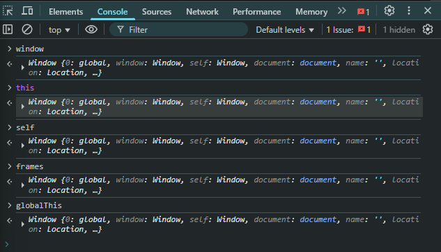

# 💻 Episode 03: Let's Write Code

This episode covers setting up the Node.js environment, writing and running the first script, and understanding the concept of the `global` object.

## Setting Up Your Environment

1. **Download Node.js:** Go to the official [nodejs.org](https://nodejs.org) website and download the installer for your operating system.
2. **Verify Installation:** Open your terminal and check the versions. NPM is included with the Node.js installation automatically.

   ```bash
   # Check Node.js version
   node -v

   # Check NPM version
   npm -v
   ```

## The Node.js REPL

- **REPL** stands for **R**ead, **E**valuate, **P**rint, **L**oop.
- It's a simple, interactive command-line tool for running and testing JavaScript/Node.js code snippets quickly.
- You can start it by simply typing `node` in your terminal.
- **Note:** The REPL is great for quick tests but is **not used for production applications**.

## Running Your First Node.js Script

1. Create a project folder (e.g., `namaste-node`).
2. Inside the folder, create a file named `app.js`.
3. Add your JavaScript code to `app.js`.

**`app.js` Example:**

```javascript
var name = "Namaste Node.js";

var a = 10;
var b = 20;
console.log("Sum is: ", a + b);

console.log("Welcome to ", name);
console.log("This is Episode 3 of Season 1");

console.log("--- Global Object ---");
console.log(global);

console.log("--- 'this' Keyword ---");
console.log(this);

console.log("--- globalThis ---");
console.log(globalThis === global); // true
```


