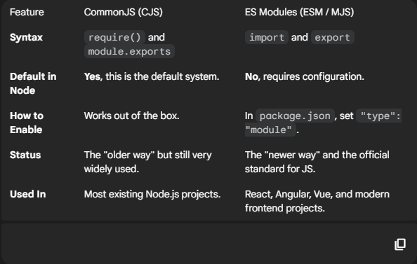

# 📦 Episode 04: module.exports & require

This episode focuses on modularizing Node.js applications by mastering `module.exports` and `require`. It covers best practices for organizing your codebase to make projects more maintainable and scalable.

## Why Use Modules?

A **module** is simply a separate piece of JavaScript code in its own file. Instead of writing all our code in a single large `app.js` file, we break it down into smaller, manageable modules. This is crucial for creating a clean and organized folder/directory structure in any real-world project.

A Node.js application has one main **entry point** (e.g., the file you run with `node app.js`). All other files are separate modules that can be brought into the main file.

## The `require` Function

To make two modules work together, we use the built-in `require()` function, which is always available in Node.js.

- **Purpose:** The `require()` function is used to import other modules into your current file.
- **Execution Flow:** When Node.js encounters `require('./xyz.js')`, it first executes all the code inside `xyz.js` and then continues executing the code in the current file.

## The Module Scope: Private by Default

A core concept in Node.js is that **modules are protected (private) by default**. You cannot access the variables, methods, or functions of one module from another just by using `require()`.

To make code from a module available elsewhere, you must explicitly export it using `module.exports`.

### Exporting and Importing

`module.exports` starts as an empty object (`{}`). You can attach anything you want to export to this object.

**1. Exporting a Single Function:**
_In `sum.js`:_

```javascript
const calculateSum = (a, b) => {
  return a + b;
};

// Expose the function
module.exports = calculateSum;
```

In `app.js`:

```js
// Import the function
const calculateSum = require("./sum.js");

const result = calculateSum(10, 5); // 15
```

## CommonJS(CJS) vs ES Modules(ESM)

Node.js has two different module systems. While this course uses CommonJS, it's crucial to know the difference.



## Key Differences (Interview Focus)

- Loading:

  - CJS is synchronous. When you require a module, Node.js stops executing until the module is loaded.
  - ESM is asynchronous. This allows for performance optimizations and features like top-level await.

- Mode:
  - CJS runs in non-strict mode by default.
  - ESM runs in strict mode by default (which helps catch common coding errors).
